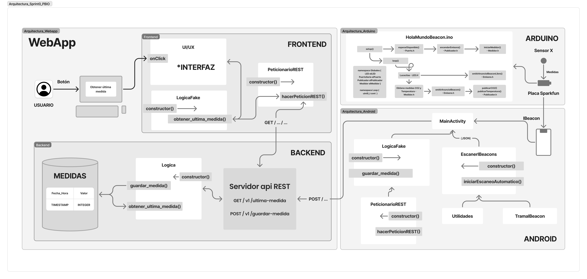

# Sprint 0 - PBIO

## Descripción

El proyecto **Sprint 0 - PBIO** es un sistema integrado diseñado para recibir, almacenar y mostrar datos provenientes de una placa emisora de beacons. Consta de tres componentes principales: Arduino, Android y una aplicación web con backend en Python. Desde su inicio, se ha desarrollado con un enfoque profesional, buscando la máxima escalabilidad, modularidad y facilidad de mantenimiento, siguiendo buenas prácticas de desarrollo y una arquitectura pensada para ser ampliada en futuros sprints sin necesidad de reestructuraciones complejas.

## Arquitectura del proyecto

El flujo de datos entre los componentes es el siguiente:

1. **Arduino:** La placa emisora genera beacons con datos simulados. Cada beacon contiene información que se envía a dispositivos Android cercanos mediante Bluetooth.
2. **Android:** La aplicación móvil recibe los beacons, los convierte a JSON y realiza peticiones POST a la API REST del backend. La app permite seleccionar los emisores de los cuales recibir datos y está preparada para futura integración de servicios en segundo plano.
3. **Web (Python + FastAPI):**

   * **Backend:** Gestiona la API REST y la lógica de negocio, aislando el almacenamiento y recuperación de datos.
   * **Lógica de negocio:** Implementa funciones como `guardar_medicion()` y `obtener_ultima_medicion()`.
   * **Frontend:** Página web construida con HTML, CSS y JavaScript, que permite interactuar con la API mediante botones y mostrar la última medición.
   * **Base de datos:** SQLite ligera, con una tabla que almacena la medición y la fecha/hora.

### Diagrama de arquitectura



### Estructura de carpetas (ficheros importantes)

```
android/
 └─ BeaconRESTApp/
     └─ app/src/main/java/com/example/beaconrestapp/
         ├─ MainActivity.java
         ├─ EscanerIBeacons.java
         ├─ LogicaFake.java
         ├─ PeticionarioREST.java
         ├─ TramaIBeacon.java
         └─ Utilidades.java
arduino/
 └─ HolaMundoIBeacon/
     ├─ HolaMundoIBeacon.ino
     ├─ EmisoraBLE.h
     ├─ LED.h
     ├─ Medidor.h
     ├─ Publicador.h
     ├─ PuertoSerie.h
     └─ ServicioEnEmisora.h
webapp/
 ├─ backend/
 │  ├─ api/
 │  │  ├─ app.py
 │  │  ├─ routes.py
 │  │  └─ tests/test_api.py
 │  ├─ logic/
 │  │  ├─ logica.py
 │  │  └─ tests/test_logic.py
 │  ├─ db/
 │  │  ├─ measurements.db  # generado automáticamente
 │  │  ├─ db_utils.py
 │  │  ├─ init_db.py
 │  │  └─ sql/
 │  │      ├─ create_measurements.sql
 │  │      └─ insert_measurements.sql
 └─ frontend/
     ├─ index.html
     ├─ js/
     │  ├─ peticionario_REST.js
     │  ├─ logica_fake.js
     │  └─ scripts.js
     └─ css/
         └─ styles.css
```

## Tecnologías utilizadas

* Arduino (C++)
* Android Studio (Java)
* Python 3.11+
* FastAPI
* HTML, CSS, JavaScript
* SQLite
* Pytest
* Git con Git Flow

## Requisitos e instalación

### Windows

```powershell
cd webapp
python -m venv .venv
.\.venv\Scripts\activate
pip install --upgrade pip
pip install -r requirements.txt
```

### Linux / Mac OS

```bash
cd webapp
python3 -m venv .venv
source .venv/bin/activate
pip install --upgrade pip
pip install -r requirements.txt
```

No se requiere instalación adicional para Arduino ni Android.

## Ejecución

1. **Configurar IP en Android:** Cambiar la IP en el código de la app Android por la del servidor. La app y el servidor deben estar en la misma red Wi-Fi.
2. **Ejecutar backend y frontend (local):**

```bash
python run.py
```

* Ejecutando de esta manera, el servidor funciona localmente y la web es accesible solo desde la máquina local. No se puede recibir solicitudes desde otros dispositivos.

3. **Ejecutar API REST (accesible desde la red):**

```bash
uvicorn backend.api.app:app --host 0.0.0.0 --port 8000 --reload
```

* Cambiar el puerto si es necesario.
* Acceder a `http://localhost:8000/` desde un navegador para probar.

4. **Pruebas automáticas:**

```bash
pytest
```

* Ejecuta todos los tests de `backend/api/tests` y `backend/logic/tests`.

## Flujo final Sprint 0

1. La placa Arduino emite beacons con datos simulados.
2. Android recibe los beacons, los transforma a JSON y realiza un POST a la API REST.
3. La lógica de negocio almacena la medición en SQLite.
4. En la web, un botón permite obtener la última medición mediante un GET a la API REST y mostrarla en la interfaz.

Este flujo demuestra la integración completa de los tres componentes, asegurando que los datos puedan moverse desde la placa hasta la visualización web de forma segura, clara y escalable.

## Buenas prácticas

El proyecto se ha desarrollado siguiendo un enfoque profesional:

* La lógica de negocio está completamente separada de la interfaz y de las rutas del API.
* Cada módulo tiene responsabilidades claras y encapsula funcionalidades específicas.
* La arquitectura modular permite escalar y añadir nuevas funcionalidades sin necesidad de refactorizaciones profundas.
* Se utilizó Git con Git Flow para mantener un control de versiones ordenado y profesional.
